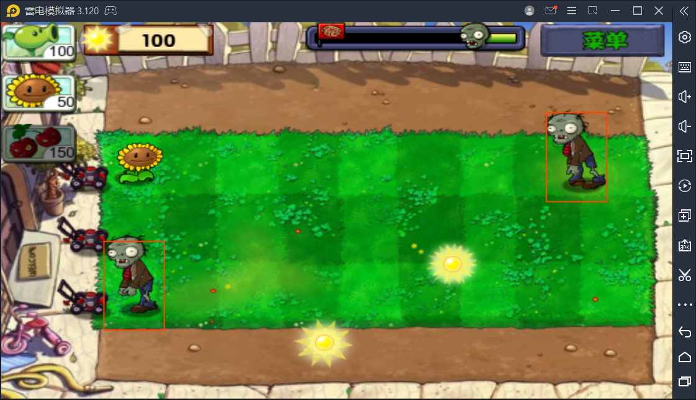

# Android_float_view_draw

植物大战僵尸网盘地址:
链接：https://pan.baidu.com/s/15N_GaoDQBGPfIfXwfvA9dA
提取码：zd68

## root进程
root进程代码在 ./app/jni
该进程负责读取游戏内僵尸的坐标并使用udp转发.
### root进程编译
在./app/jni目录下执行ndk-build
生成的可执行文件在
```
./app/libs
```
将jni_draw改名为
```
libjni_draw.so
```
配置build.gradle
在android里加上
```
sourceSets {
        main {
            jniLibs.srcDirs = ['libs']
        }
    }
```
就把可执行文件打包到app中
## app
用最新版android studio打开,直接点右上方运行即可

